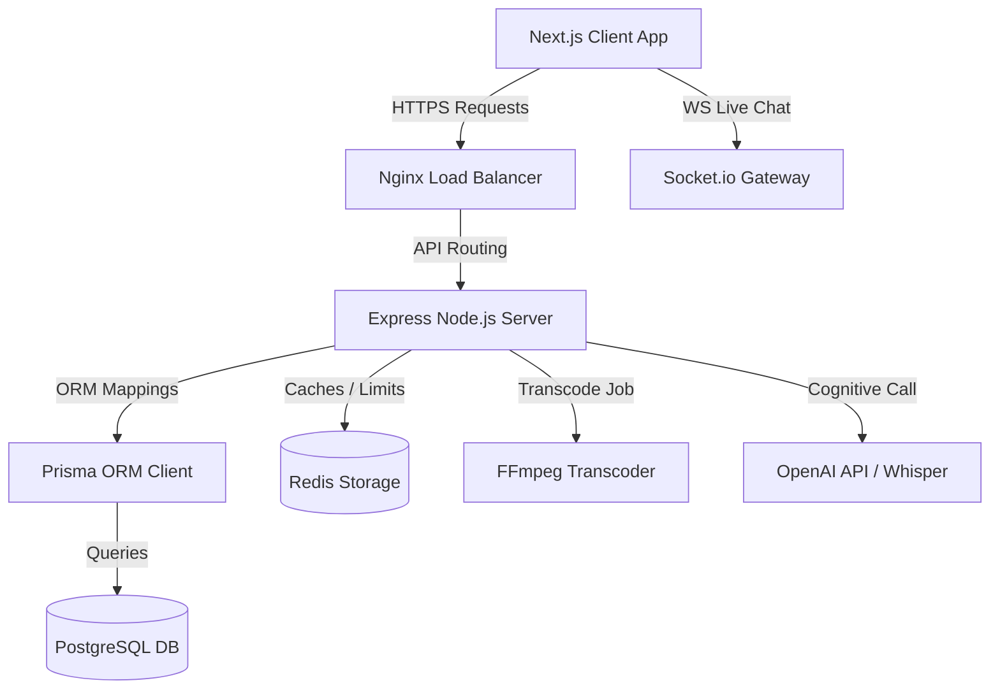
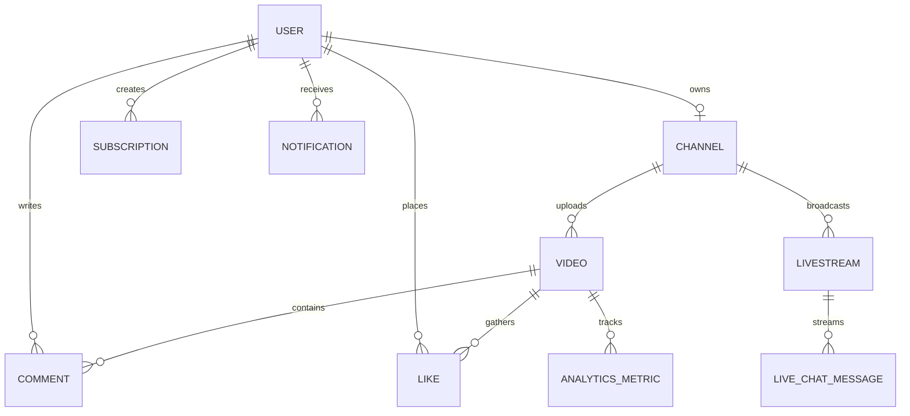

# StreaminAi - Premium AI-Powered Video & Live Streaming Platform

StreaminAi is a production-grade, end-to-end video streaming and live-broadcasting platform engineered with advanced AI capabilities. It incorporates high-fidelity Next.js 14+ layouts, Express.js microservice controllers, PostgreSQL database mapping, and real-time Socket.io streams, supplemented by AI Whisper transcripts, interactive video companion chat helpers, SEO assistants, and comment moderation rules.

---

## 1. Product Requirements Document (PRD) & Features

### Core Target Users
- **Viewers**: Tech enthusiasts and learners seeking high-quality videos and live streams with integrated study companions.
- **Creators**: Developers and educators seeking to host tutorials, track performance metrics, and leverage AI to auto-generate transcripts and descriptions.
- **Administrators**: Managers auditing logs, monitoring platform performance, and configuring security rules.

### Key Features Checklist
- **Dynamic HLS Player**: Custom React player featuring resolution switching, volume nodes, and timelines.
- **FFmpeg Transcoding Pipeline**: Automated back-end transcoders compiling uploads into multi-bitrate HLS streams, with automated socket progress notifications.
- **Live Stream Rooms**: Real-time websocket broadcasts showing chat feeds and live counters.
- **AI Whisper Transcriptions**: Automatic caption compilation of uploaded media.
- **AI Chat Companion**: Collapsible conversational bot companion allowing viewers to ask specific contextual questions about a video.
- **Stripe billing upgrades**: Instant billing simulation upgrading creators to PRO or ENTERPRISE levels.
- **Interactive SVG Charts**: Responsive traffic charting built using custom React SVG markers.

---

## 2. System Architecture

StreaminAi uses a decoupled layout designed for containerized deployments:



### Entity-Relationship Diagram (ERD)



---

## 3. Tech Stack
- **Frontend**: Next.js 14+ (React 18), Tailwind CSS, Lucide Icons, Socket.io-client.
- **Backend**: Node.js, Express.js, TypeScript, Socket.io.
- **Database**: PostgreSQL (Prisma ORM).
- **Video Tools**: FFmpeg (Transcoding video to `.m3u8` playlists and segment files).
- **AI Integrations**: OpenAI GPT (transcripts chat & metadata generator), Whisper (speech-to-text).
- **Caching**: Redis (rate-limiting and view-counter buffer).

---

## 4. Quick Start & Execution Guide

### Prerequisite Checklist
- Ensure you have **Node.js v18+** installed.
- Ensure **Docker Desktop** is running (if deploying via containers).

### Method A: Run via Docker Compose (Recommended)
This spins up the entire production-grade stack including Nginx proxy, PostgreSQL, Redis, backend APIs, and Next.js frontend:

1. Clone or navigate to the directory `C:\Users\Nagesh\.gemini\antigravity\scratch\streamin-ai`
2. Spin up the container services:
   ```bash
   docker-compose up --build
   ```
3. Open your browser and navigate to `http://localhost`. The reverse proxy (Nginx) handles everything.

### Method B: Run Locally (Development Fallback)
If you want to run services locally without Docker:

1. **Setup Backend**:
   ```bash
   cd backend
   npm install
   # Run local DB migrations (for PostgreSQL). 
   # Note: For SQLite fallback, change provider to "sqlite" in schema.prisma and database url in .env to "file:./dev.db"
   npx prisma db push
   # Seed default developer channels and videos
   npm run prisma:seed
   # Start server
   npm run dev
   ```

2. **Setup Frontend**:
   ```bash
   cd ../frontend
   npm install
   npm run dev
   ```
3. Open browser and visit `http://localhost:3000`.

---

## 5. Security & Best Practices
- **JWT tokens & RBAC**: Secure JSON Web Tokens containing role payloads (VIEWER, CREATOR, ADMIN) guarding routes.
- **Toxicity comment filter**: Automated checking of comments against lists of inappropriate words and OpenAI Moderation endpoints.
- **Environment variables segregation**: Private secrets and tokens contained within `.env` parameters.
- **Direct upgrade mock pathways**: Simplifies billing evaluations without complex sandbox integrations.

---

## 6. Multi-Platform Packaging (Windows & Android)

StreaminAi is configured to compile into standalone native clients:

### Build Next.js Static Assets
All wrapper native applications load from Next.js statically compiled files. Generate them by running:
```bash
cd frontend
npm run build
```
This generates HTML/CSS/JS files inside the `frontend/out/` directory.

### A. Windows Desktop App (Electron)
1. Run local dev desktop preview:
   ```bash
   npm run desktop:dev
   ```
2. Package as a Windows `.exe` installer (saved inside `frontend/dist/`):
   ```bash
   npm run desktop:build
   ```

### B. Android App (Capacitor)
Ensure you have **Android Studio** and **Android SDK** configured.
1. Initialize the Android project container (one-off setup):
   ```bash
   npm run android:init
   ```
2. Sync Next.js static assets and update dependencies:
   ```bash
   npm run android:sync
   ```
3. Compile and open in Android Studio:
   ```bash
   npm run android:open
   ```
4. Build standard APK or bundle directly inside Android Studio.

---

## 7. Production Hosting Configuration (`stream-in.app`)
To deploy StreaminAi on a remote server mapping `https://stream-in.app/`:
1. Point your domain DNS **A Record** to the IP address of your hosting server.
2. Edit `nginx/production.conf` ensuring Let's Encrypt certificate paths match.
3. Deploy service docker configurations pointing to production configurations:
   ```bash
   # Bind production nginx routing
   docker-compose -f docker-compose.yml -f production-override.yml up -d
   ```

